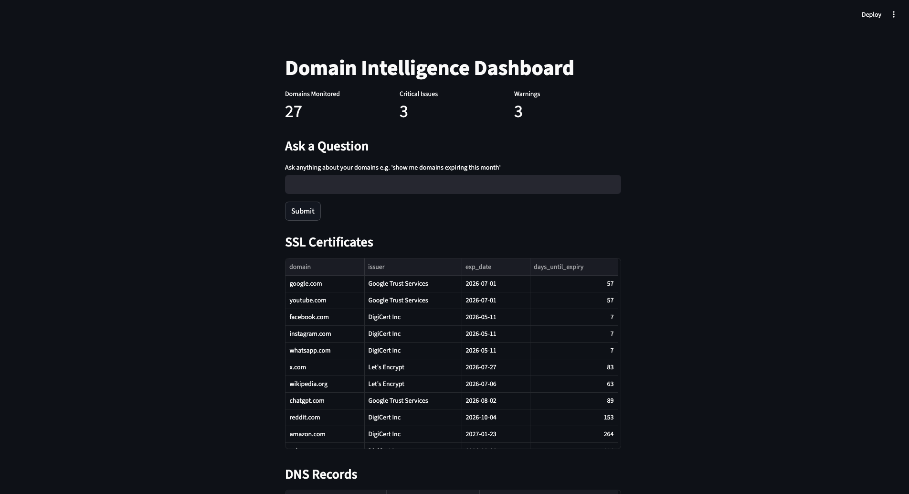

# Domain Intelligence Dashboard

An AI-powered domain monitoring tool that automatically tracks DNS records and SSL certificates, detects anomalies, and lets you query your domain data in plain English using an LLM agent.

Built with Python, SQLite, Groq LLM API, and Streamlit.



---

## What it does

- Fetches **DNS records** (A, MX, NS) for a list of domains using dnspython
- Fetches **SSL certificate data** directly via TLS handshake — no external API needed
- Stores everything in a **SQLite database** with a full audit trail
- Detects anomalies and classifies them as **CRITICAL / WARNING / INFO**
- Uses a **Groq LLM agent** to summarize issues in plain English
- Answers **natural language questions** about your domains — type a question, get back live data
- Displays everything in a **Streamlit web dashboard**

---

## Tech Stack

| Layer | Technology |
|---|---|
| Language | Python 3.11 |
| DNS Fetching | dnspython |
| SSL Fetching | ssl + socket (built-in) |
| Database | SQLite via sqlite3 |
| Data Handling | pandas |
| AI / LLM | Groq API (Llama 3.3 70b) |
| Dashboard | Streamlit |
| Containerisation | Docker |

---

## Project Structure

```
domain-intelligence-dashboard/
├── main.py              # master pipeline — run this to fetch and store data
├── dashboard.py         # Streamlit web dashboard
├── agent.py             # LLM agent — summarizer + natural language query
├── anomaly.py           # anomaly detection and severity classification
├── database.py          # SQLite connection, table creation, insert functions
├── utils.py             # shared helpers (load_domain, get_timestamp)
├── scanners/
│   ├── fetch_dns.py     # DNS record fetcher
│   └── fetch_ssl.py     # SSL certificate fetcher
├── domain.txt           # list of domains to monitor
├── Dockerfile
├── docker-compose.yml
├── requirements.txt
└── .env.example
```

---

## Getting Started

### Option 1 — Docker (recommended)

1. Clone the repo:
```bash
git clone https://github.com/kartikeyadl/domain-intelligence-dashboard.git
cd domain-intelligence-dashboard
```

2. Create your `.env` file:
```bash
cp .env.example .env
```

Add your Groq API key to `.env`:
```
GROQ_API_KEY=your_key_here
```

Get a free key at [console.groq.com](https://console.groq.com)

3. Add domains to `domain.txt` — one per line:
```
github.com
google.com
ionos.com
```

4. Run the data pipeline first:
```bash
docker-compose run dashboard python main.py
```

5. Start the dashboard:
```bash
docker-compose up
```

6. Open your browser at `http://localhost:8501`

---

### Option 2 — Local Setup

1. Clone the repo and install dependencies:
```bash
git clone https://github.com/kartikeyadl/domain-intelligence-dashboard.git
cd domain-intelligence-dashboard
pip install -r requirements.txt
```

2. Create your `.env` file and add your Groq API key:
```bash
cp .env.example .env
```

3. Run the pipeline to populate the database:
```bash
python main.py
```

4. Start the dashboard:
```bash
streamlit run dashboard.py
```

---

## How It Works

### Data Pipeline
`main.py` loads domains from `domain.txt`, fetches DNS and SSL data, and stores everything in `domains.db`. Every run is logged to a `fetch_history` table so you always know when data was last refreshed.

### Anomaly Detection
`anomaly.py` queries the database and classifies issues by severity:

| Severity | Condition |
|---|---|
| CRITICAL | SSL cert expires in 7 days or fewer |
| WARNING | SSL cert expires in 8–30 days, or domain has no MX record |
| INFO | SSL cert expires in 31–60 days, or domain has multiple A records |

### AI Agent
`agent.py` uses the Groq LLM API with two features:

- **Summarizer** — feeds anomalies to the LLM and returns a structured summary grouped by severity
- **Natural language query** — converts a plain English question into SQL, validates it is SELECT only, executes it against the database, and returns a live DataFrame

### Dashboard
`dashboard.py` displays everything in a Streamlit interface with metric cards, data tables, an AI analysis panel, and a natural language query input box.

---

## Environment Variables

| Variable | Description |
|---|---|
| `GROQ_API_KEY` | Your Groq API key — get one free at [console.groq.com](https://console.groq.com) |

---

## License

MIT
